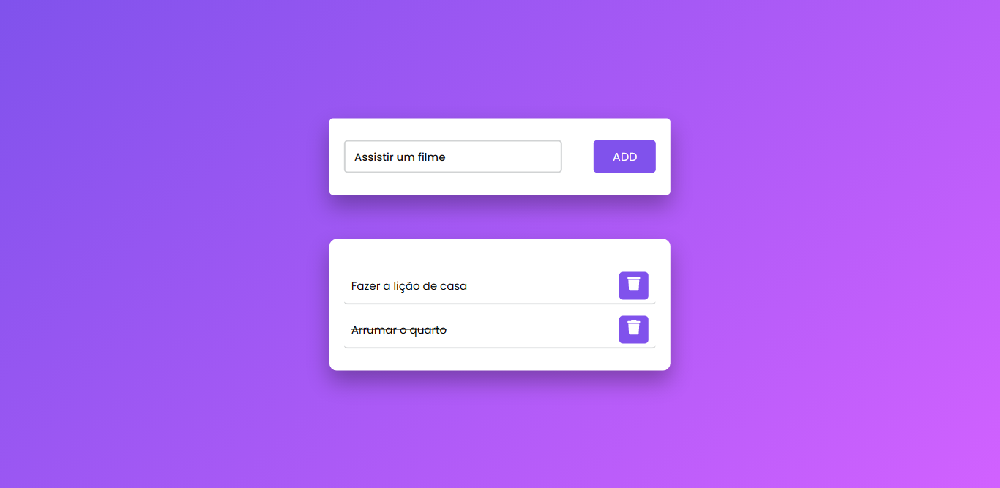

<h1 align="center"> Lista To Do  </h1>

Uma simples lista to do, tendo como principais características a adição, remoção e marcar a tarefa como feita, usando HTML, CSS e JavaScript.

  <a href="#-tecnologias">Tecnologias</a>&nbsp;&nbsp;&nbsp;|&nbsp;&nbsp;&nbsp;
  <a href="#-projeto">Projeto</a>&nbsp;&nbsp;&nbsp;|&nbsp;&nbsp;&nbsp;
  <a href="#-contato">Contato</a>

  

 

  

## 🚀 Tecnologias

Esse projeto foi desenvolvido com as seguintes tecnologias:

- HTML
- CSS
- JavaScript DOM

## 💻 Projeto

Um projeto maneirão, desenvolvido por conta desse [vídeo](https://www.youtube.com/watch?v=cOUNOi297Mw&list=PLNCevxogE3fgy0pAzVccadWKaQp9iHspz&index=1') do [Coding Artist](https://www.youtube.com/@CodingArtist)

Dê uma olhada no projeto clicando nesse [link](https://matheusfdosan.github.io/to-do-list/).

## Contato

- Acesse também meus outros repositórios no [Github](https://github.com/matheusfdosan?tab=repositories).

- Também me siga no [Instagram](https://instagram.com/matheusfdosan).
